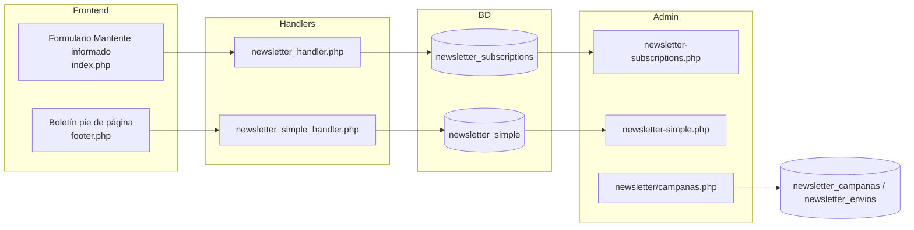

# Mercadotecnia en Fase 2 y Fase 3 — Aramed y Laboratorios

**Documento generado a partir del análisis del repositorio**  
**Ruta del proyecto:** `/Users/gorila/Desktop/CLONE/GIT/aramed`  
**Fecha:** 9 de junio de 2026  
**Desarrollador:** IDEAMIA Tech  

---

## 1. Cómo se nombra “Fase 2” y “Fase 3” en este proyecto

En la documentación del repo conviven **dos niveles** de nomenclatura. Conviene distinguirlos para no mezclar alcances.

| Nivel | Qué significa | Documentos de referencia |
|--------|----------------|---------------------------|
| **Fase 2 (contrato / proyecto)** | Panel administrativo completo (~210 h): CMS para gestionar sitio, contenidos, leads, SEO y correo | `DOCS/context-fase2.md`, `DOCS/RESUMEN_EJECUTIVO_FASE2.md`, `database/fase2/` |
| **Sub-fases internas del plan de trabajo** | División del desarrollo en bloques semanales dentro de esa Fase 2 | `DOCS/PLAN_TRABAJO_FASE2.md`, `DOCS/ESTADO_FASE2.md` |

### Sub-fases internas relevantes para mercadotecnia

| Sub-fase interna | Semanas (plan) | Enfoque mercadotecnia |
|------------------|----------------|------------------------|
| **Fase 2 — Contenido crítico** | 3–4 | Home editable desde admin + catálogo (textos, imágenes, marcas, productos destacados) |
| **Fase 3 — Nuevos módulos** | 5–6 | Proyectos (portafolio) + blog con publicación programada |
| **Fase 5 — Optimización** | 9–10 | SEO, newsletter avanzado (plantillas/campañas), Google Analytics |
| **Fase 6 — Finalización** | 11–12 | Apariencia del sitio, menú dinámico, secciones on/off |

> **Nota:** En `DOCS/context-fase2.md`, una **“Fase 3” futura (contrato)** se reserva para API pública REST e integraciones ERP/CRM. Eso **no está implementado** en el código actual.

---

## 2. Objetivo para el equipo de mercadotecnia

La integración permite que Marketing gestione, **sin programar**:

- La **imagen y mensaje** del sitio (hero, aliados, servicios, topbar).
- **Contenido editorial** (blog, proyectos, páginas estáticas — según rol).
- **Captación de audiencia** (boletín del pie, formulario “Mantente informado”, campañas de correo).
- **Visibilidad en buscadores** (metadatos, sitemap, robots, redirecciones, Schema.org).
- **Medición** (GA4 y eventos de conversión en formularios y cotizador).

Todo ello desde `/admin/` con control de acceso por rol (**RBAC**).

---

## 3. Rol “Marketing” y permisos

Definido en `database/fase2/00_create_all_tables.sql` (y documentado en `database/fase2/README.md`):

| Módulo | Permisos del rol `marketing` |
|--------|-------------------------------|
| **home** | ver, crear, editar, eliminar |
| **blog** | ver, crear, editar, eliminar, moderar |
| **newsletter** | ver, editar, importar, exportar (+ crear campañas si existe permiso `crear`) |
| **seo** | ver, editar |
| **analytics** | ver, editar (en BD; ver limitación de UI más abajo) |
| **catalogo** | solo **ver** y **editar** (no crear/eliminar productos por defecto) |

**No incluye por defecto:** proyectos, apariencia, menú, contacto, cotizaciones, usuarios, configuración SMTP.

Otros roles útiles:

- **editor** — home, blog, catálogo, proyectos (sin configuración global).
- **ventas** — catálogo, cotizaciones, contacto (lectura).
- **analista** — solo lectura en todos los módulos.
- **admin** — acceso total.

Implementación técnica: `includes/rbac_functions.php`, `admin/auth_check.php`, menú en `admin/includes/admin_menu.php`.

---

## 4. Qué se integró en la sub-fase 2 (contenido del sitio)

### 4.1 Gestor de Home (`/admin/home/`)

Permite administrar lo que ve el visitante en la landing (`public_html/index.php` lee desde BD vía `includes/home_data.php`).

| Submódulo | Admin | Tablas BD | Frontend |
|-----------|-------|-----------|----------|
| Banners / Hero | `admin/home/banners.php` | `home_banners` | Sección `#hero` |
| Productos destacados | `admin/home/productos-destacados.php` | `home_productos_destacados` | `#productos` |
| Servicios | `admin/home/servicios.php` | `home_servicios` | `#servicios` |
| Aliados / partners | `admin/home/aliados.php` | `home_aliados` | `#aliados`, `#aliados-detalle` |
| Misión y visión | `admin/home/mision-vision.php` | `home_mision_vision` | Sección misión/visión |
| Categorías destacadas | `admin/home/categorias-destacadas.php` | `home_categorias_destacadas` | Bloques de categorías |
| Dashboard home | `admin/home/index.php` | — | — |

**Scripts SQL:** `database/fase2/01_create_home_tables.sql`, migraciones `10`–`17`, `sync_home_aliados_pdf_brief.sql` (mantenimiento).

**Mercadotecnia puede:** cambiar mensajes del hero, orden de aliados, CTAs, textos de servicios y productos destacados sin tocar código.

### 4.2 Catálogo (`/admin/catalogo/`)

| Función | Archivos | Uso para marketing |
|---------|----------|-------------------|
| Productos, categorías, marcas | `admin/catalogo/productos/*`, `categorias.php`, `marcas.php` | Fichas con SEO, imágenes, descripciones, flags “destacado” |
| Import / export masivo | `productos/import.php`, `export.php` | Campañas de actualización de catálogo |
| Frontend | `catalogo.php`, `producto.php` | Embudo hacia cotización |

**Scripts SQL:** catálogo en `database/nueva_estructura_catalogo.sql`, migración `database/migracion_datos_catalogo.sql`.

### 4.3 Mensajes del topbar (`/admin/topbar-messages.php`)

Barra superior rotativa del sitio (`includes/topbar.php`).

- CRUD de mensajes promocionales con enlace, fechas de vigencia y estado.
- Cron de expiración: `public_html/cron/expire_topbar_messages.php`.
- Permiso: módulo **home** (editar) o **configuración**.

**Uso típico de marketing:** anunciar cursos, catálogo nuevo, promociones estacionales.

---

## 5. Qué se integró en la sub-fase 3 (contenido editorial y portafolio)

### 5.1 Módulo Proyectos

| Capa | Ubicación |
|------|-----------|
| Admin CRUD | `admin/proyectos/` (index, create, edit, view, uploads) |
| Frontend | `proyectos.php`, `proyecto.php` |
| BD | `database/fase2/02_create_proyectos_tables.sql` → `proyectos`, `proyecto_imagenes`, `proyecto_videos`, `proyecto_documentos` |

**Funciones:** casos de éxito, galería, videos, PDFs, SEO por proyecto, filtros por año/sector.

**Permiso:** rol **editor** y **admin**; el rol **marketing** no lo tiene en la matriz RBAC por defecto (se puede ampliar desde `admin/usuarios.php` → permisos por rol).

### 5.2 Blog — publicación programada

| Función | Ubicación |
|---------|-----------|
| Artículos, categorías, comentarios | `admin/blog/` |
| Programación | campo `fecha_programada`, filtros en listado |
| Publicación automática | `publicarArticulosProgramados()` en `includes/functions.php` + cron `public_html/cron/publicar_articulos.php` |
| Frontend | `blog.php`, `blog-detalle.php` |
| SQL | `database/fase2/04_add_blog_programacion.sql` |

**Mercadotecnia puede:** planificar contenido, moderar comentarios, gestionar imágenes (`image-manager.php`), SEO por artículo.

---

## 6. Herramientas de mercadotecnia digital (sub-fase 5 del plan interno)

Aunque en el cronograma aparecen en “semanas 9–10”, forman el **núcleo de email marketing y SEO** entregado en el proyecto Fase 2.

### 6.1 Newsletter y correo

Existen **tres capas** de suscripción/correo:

| Componente | Descripción | Admin |
|------------|-------------|-------|
| **Suscripción simple (pie)** | Solo email; tabla `newsletter_simple` | `admin/newsletter-simple.php` |
| **Formulario completo (home)** | Institución, contacto, producto de interés; tabla `newsletter_subscriptions` | `admin/newsletter-subscriptions.php` (permiso cotizaciones/ver) |
| **Plantillas HTML** | Variables `{{nombre_contacto}}`, etc. | `admin/newsletter/plantillas.php` |
| **Campañas masivas** | Envío por plantilla, filtro por estado, registro de envíos | `admin/newsletter/campanas.php`, `campana-detalle.php` |
| **Import / export CSV** | Listas para uso externo o limpieza | `admin/newsletter/import.php`, `export.php` |
| **Configuración** | Textos legales, doble opt-in (opción en UI) | `admin/newsletter/config.php` |
| **Tracking de aperturas/clics** | Pixel y redirección | `track-email.php`, `track-click.php` |

**Scripts SQL:** `09_create_newsletter_templates.sql`, `24_create_newsletter_campanas_tables.sql`.

**Anti-spam reciente (sitio público):** honeypot, timestamp, reCAPTCHA v3, rate limit, correos desechables — en handlers compartidos (`includes/functions.php`).

**No implementado aún:** integración nativa con Mailchimp/SendGrid/Acumbamail (previsto como evolutivo en `DOCS/context-fase2.md`). El flujo actual usa **SMTP propio** (`includes/email_functions.php`, config en `admin/configuracion/`).

### 6.2 SEO y metadatos (`/admin/seo/`)

| Pantalla | Función |
|----------|---------|
| `index.php` | Dashboard SEO |
| `config.php` | Título global, favicon, OG image, metadatos por página |
| `metadatos.php` | SEO por entidad (producto, artículo, proyecto…) |
| `robots.php` | Editor de `robots.txt` |
| `sitemap.php` | Generación / gestión de sitemap |
| `redirects.php` | Redirecciones 301/302 |
| `schema.php` | Schema.org (Organization, Product, BlogPosting…) |

**BD:** `database/fase2/08_create_seo_tables.sql` → `seo_config`, `seo_metadatos`, `redirects`.  
**Helpers:** `includes/seo_functions.php`, `public_html/sitemap.php`.

**Menú admin:** SEO visible para **admin** y usuarios con permiso `seo/ver` (rol marketing incluido).

### 6.3 Google Analytics (`/admin/analytics/`)

| Componente | Ubicación |
|------------|-----------|
| Configuración GA4 | `admin/analytics/config.php` (Measurement ID en tabla `configuracion`) |
| Dashboard | `admin/analytics/dashboard.php` |
| Script en sitio | `includes/analytics.php`, `includes/analytics_events.php` |
| Eventos personalizados | `add_to_quote`, `submit_quote`, `submit_contact`, `subscribe_newsletter`, etc. |

**Limitación actual:** el ítem **Analytics** del menú lateral está restringido a **`rol = admin`** en `admin_menu.php` y `analytics/dashboard.php`, aunque el rol `marketing` tiene permisos en BD. Marketing puede usar GA4 directamente en Google o pedir a admin ampliar acceso.

### 6.4 Apariencia, menú y páginas estáticas (Fase 6 interna)

| Módulo | Admin | BD |
|--------|-------|-----|
| Activar/ocultar secciones del home | `admin/apariencia/secciones.php` | `home_secciones` |
| Páginas estáticas | `admin/apariencia/paginas.php` | `paginas_estaticas` |
| Vista previa | `admin/apariencia/vista-previa.php` | — |
| Menú principal | `admin/menu/index.php` | `menu_config` (`23_create_menu_config_table.sql`) |

**SQL:** `database/fase2/09_create_apariencia_tables.sql`.

**Limitación:** en el menú admin, **Apariencia** y **Menú** solo se muestran si `rol = admin`. Mercadotecnia no los ve por defecto.

---

## 7. Mapa rápido: URL admin → acción de marketing

| Quiero… | Ir a… |
|---------|--------|
| Cambiar slide del hero | `/admin/home/banners.php` |
| Ordenar logos de aliados | `/admin/home/aliados.php` |
| Editar tarjetas de servicios | `/admin/home/servicios.php` |
| Publicar nota de blog | `/admin/blog/create.php` |
| Programar artículo | `/admin/blog/edit.php` (fecha programada) + cron |
| Enviar boletín masivo | `/admin/newsletter/campanas.php` |
| Editar plantilla de correo | `/admin/newsletter/plantillas.php` |
| Exportar suscriptores del pie | `/admin/newsletter/export.php` |
| Ver leads del formulario grande | `/admin/newsletter-subscriptions.php` |
| Ajustar meta título / OG | `/admin/seo/config.php` |
| Crear redirección 301 | `/admin/seo/redirects.php` |
| Anuncio en barra superior | `/admin/topbar-messages.php` |
| Caso de éxito nuevo | `/admin/proyectos/create.php` (si tienen permiso) |

---

## 8. Base de datos — tablas clave para mercadotecnia

| Tabla | Propósito |
|-------|-----------|
| `home_banners`, `home_servicios`, `home_aliados`, `home_productos_destacados`, `home_mision_vision`, `home_categorias_destacadas` | Contenido del inicio |
| `topbar_messages` | Mensajes promocionales rotativos |
| `blog_articulos`, `blog_categorias`, `blog_comentarios` | Blog |
| `proyectos`, `proyecto_*` | Portafolio |
| `newsletter_simple` | Suscriptores del pie |
| `newsletter_subscriptions` | Formulario completo / leads |
| `newsletter_templates` | Plantillas HTML |
| `newsletter_campanas`, `newsletter_envios` | Campañas y métricas de envío |
| `seo_config`, `seo_metadatos`, `redirects` | SEO |
| `configuracion` | GA4, SMTP, textos legales, datos empresa |
| `home_secciones`, `paginas_estaticas`, `menu_config` | Layout y navegación |
| `permisos`, `rol_permisos` | Quién puede hacer qué |

**Instalación consolidada:** `database/fase2/00_create_all_tables.sql`  
**Guía:** `database/fase2/README.md`

---

## 9. Frontend conectado (punto de contacto con el público)

| Elemento público | Handler / origen de datos |
|------------------|---------------------------|
| Hero, aliados, servicios, productos home | BD → `index.php` |
| Formulario “Mantente informado” | `includes/newsletter_handler.php` → `newsletter_subscriptions` |
| Boletín footer “Suscríbete” | `includes/newsletter_simple_handler.php` → `newsletter_simple` |
| Modal Contáctanos | `includes/contact_handler.php` → `contact_messages` |
| Blog y comentarios | `blog-detalle.php`, `blog_comment_handler.php` |
| Catálogo y carrito cotización | `catalogo.php`, `cotizacion.php`, `quote_handler.php` |
| GA4 + eventos | `includes/analytics_events.php`, gtag en páginas |

---

## 10. Estado de implementación (resumen)

Según `DOCS/RESUMEN_EJECUTIVO_FASE2.md` y código en repo:

| Área mercadotecnia | Estado | Observación |
|--------------------|--------|-------------|
| Gestor Home | ✅ Completo | Contenido dinámico en producción |
| Catálogo admin | ✅ Completo | Catálogo puede estar oculto en menú público según `menu_config` |
| Blog + programación | ✅ Completo | Requiere cron activo para publicar a tiempo |
| Proyectos | ✅ Admin + frontend | Rol marketing sin acceso por defecto |
| Newsletter listas + campañas | ✅ Implementado | Sin ESP externo (Mailchimp, etc.) |
| SEO admin | ✅ Completo | |
| Analytics panel | ⚠️ Parcial | Config y eventos OK; panel solo admin |
| Apariencia / menú | ✅ Código listo | UI admin solo para rol admin |
| Doble opt-in | ⚠️ Opción en config | Flujo completo documentado como pendiente en algunos DOCS |
| API pública Fase 3 (contrato) | ❌ No iniciado | Fuera de alcance actual |

---

## 11. Puesta en marcha recomendada para el equipo de Marketing

1. **Ejecutar scripts SQL** de `database/fase2/` en producción si aún no se aplicó `00_create_all_tables.sql` (incluye permisos rol `marketing`).
2. **Crear usuario** con rol `marketing` en `/admin/usuarios.php?action=create`.
3. **Configurar SMTP** en `/admin/configuracion/` antes de campañas de correo.
4. **Crear plantilla** en `/admin/newsletter/plantillas.php` y probar campaña pequeña en `/admin/newsletter/campanas.php`.
5. **Revisar GA4** en `/admin/analytics/config.php` (o consola Google) y validar eventos en formularios.
6. **Programar cron** en servidor:
   - `public_html/cron/publicar_articulos.php` (cada 5 min)
   - `public_html/cron/expire_topbar_messages.php` (diario)
7. **Limpiar spam** en suscripciones con `database/maintenance/cleanup_newsletter_subscriptions_spam.sql` (revisar antes de DELETE).

---

## 12. Documentación relacionada en el repo

| Archivo | Contenido |
|---------|-----------|
| `DOCS/context-fase2.md` | Alcance contractual y rol Marketing / Contenido |
| `DOCS/PLAN_TRABAJO_FASE2.md` | Sub-fases 1–6 con checklists |
| `DOCS/ESTADO_FASE2.md` | Porcentajes por sub-fase |
| `DOCS/RESUMEN_EJECUTIVO_FASE2.md` | Entrega de 14 módulos |
| `DOCS/REPORTE_FASE2_COMPLETO.md` | Detalle técnico por módulo |
| `database/fase2/README.md` | Orden de migraciones SQL |
| `public_html/admin/README.md` | Autenticación y estructura admin |

---

## 13. Conclusión

Para **mercadotecnia**, la integración de **Fase 2 (proyecto)** concentra el CMS en `/admin/`: contenido del home, catálogo, blog, SEO, listas de correo y campañas propias.

Dentro del plan interno:

- **Sub-fase 2** entrega la **cara visible del sitio** (home, catálogo, topbar).
- **Sub-fase 3** entrega **contenido de autoridad** (blog programado y proyectos).
- Las herramientas **SEO, email marketing y analítica** se desarrollaron en la **sub-fase 5** del mismo proyecto Fase 2.

Lo que **aún no** delega por completo a Marketing sin apoyo de TI: panel Analytics en admin, apariencia/menú global, integración con plataformas externas de email (Mailchimp/SendGrid) y API pública (Fase 3 contractual futura).

---

*Documento elaborado por análisis del código fuente, scripts SQL y documentación en `DOCS/` y `database/fase2/`.*
